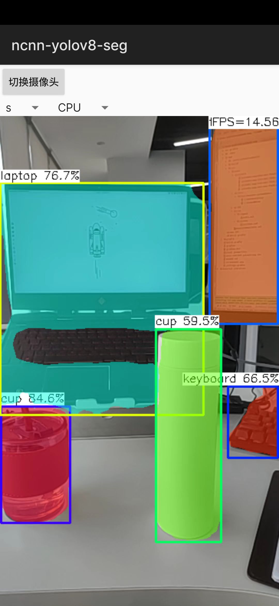

# ncnn-yolov8-seg

This is a sample ncnn yolov8 object segment android project, it depends on **ncnn** library and **opencv**.

[How to convert yolov8 model to ncnn model?](https://github.com/Digital2Slave/ncnn-android-yolov8-seg/wiki/Conver-yolov8-model-to-ncnn-model)

## 1 How to build and run

### 1.1 Configure ncnn

* Download [ncnn-YYYYMMDD-android-vulkan.zip](https://github.com/Tencent/ncnn/releases).
* Extract **ncnn-YYYYMMDD-android-vulkan.zip** into **app/src/main/jni** folder and change the **ncnn_DIR** path to yours in **app/src/main/jni/CMakeLists.txt**.

> For example:`ncnn-20221128-android-vulkan`

### 1.2 Configure OpenCV

* Download [opencv-mobile-XYZ-android.zip](https://github.com/nihui/opencv-mobile)
* Extract **opencv-mobile-XYZ-android.zip** into **app/src/main/jni** and change the **OpenCV_DIR** path to yours in **app/src/main/jni/CMakeLists.txt**.

> For example:`opencv-mobile-4.6.0-android`

### 1.3 Build and Install ncnn-yolov8-seg app

* Open this project with Android Studio, build it and enjoy!

## 2 Some notes

* Android ndk camera is used for best efficiency.
* Crash may happen on very old devices for lacking HAL3 camera interface.
* All models are manually modified to accept dynamic input shape.
* Most small models run slower on GPU than on CPU, this is common.
* FPS may be lower in dark environment because of longer camera exposure time.

## 3 Screenshot

## 4 Reference

- https://github.com/ultralytics/ultralytics 
- https://github.com/Tencent/ncnn
- https://github.com/nihui/opencv-mobile
- https://github.com/nihui/ncnn-android-nanodet 
- https://github.com/FeiGeChuanShu/ncnn-android-yolov8
